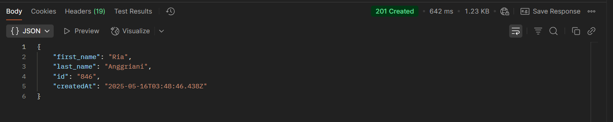

## Test Case: Create User - Reqres API

### Endpoint:
POST https://reqres.in/api/users

### Request:

json
{
  "first_name": "Ria",
  "last_name": "Anggriani"
}

### Expected Result
```
{
  "id": "123",
  "createdAt": "2025-05-15T12:00:00.000Z"
}
```

Status code : 201 Created


